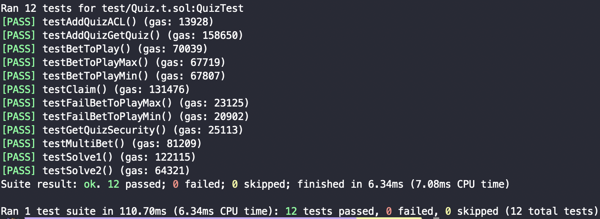

## 주어진 interface 및 test code 분석

Quiz.sol의 interface와 test code를 보고 QuizGame이 뭘 하는건지 분석해보자.

- testAddQuizACL
    
    퀴즈를 생성하여 추가하는 로직이다. 특이한 점은 address를 1로 바꾼 뒤, addQuiz를 했을 때 revert가 나야 통과한다. 또한, 퀴즈의 id는 1씩 늘어나는 것을 알 수 있다.
    

- testGetQuizSecurity
    
    1번 퀴즈를 가져와서 답이 빈 문자열임을 확인한다. 실제로 답은 빈 문자열이 아닌 것을 보아 getQuiz함수는 답을 빈 문자열로 바꿔서 반환해야 함을 알 수 있다.
    
- testAddQuizGetQuiz
    
    퀴즈를 생성하여 추가한 뒤, getQuiz를 하여 기존에 만들었던 퀴즈와 같은지 확인한다.
    
- testBetToPlay / testFailBetToPlay + Max/Min
    
    betToPlay함수를 value를 주며 호출한다. value가 min과 max 사이의 값이 아니면 revert가 나야 함을 알 수 있다.
    
- testMultiBet
    
    betToPlay함수를 2번 호출하고 각각의 value를 합친 값이 bets매핑에 저장되어 있는 것을 확인한다.
    

- testSolve1
    
    getAnswer함수를 호출하여 solveQuiz가 true를 반환하는지 확인한다.
    
- testSolve2
    
    solveQuiz에서 false를 반환한 경우, vault_balance와 bets에 저장된 값의 총합이 유지되는지를 확인한다.
    

- testClaim
    
    solveQuiz에서 true를 반환시킨 경우, claim을 하기 전과 후에 balance 차이가 배팅한 금액의 2배가 되는지 확인한다.
    

Quiz.sol의 함수 기능을 유추해보자.

- addQuiz - 주소가 이상한 값(작은 수?)이면 revert, 아니면 퀴즈 추가 → **퀴즈들 저장하는 배열 또는 매핑이 필요**
- getAnswer - 퀴즈에 대한 답을 주는 코드 (test case를 제대로 실험해보기 위해서만 쓰이는 함수인 것 같다.)
- getQuiz - 퀴즈의 답을 제외한 나머지 정보를 반환해주는 함수
- getQuizNum - 퀴즈 번호를 반환 (퀴즈의 id가 1씩 증가하므로 이전의 퀴즈 개수라고 봐도 될 것 같다.)
- betToPlay - value가 min과 max사이인지 검증, bets 매핑에 quizId와 msg.sender를 value와 매칭시켜주는 함수
- solveQuiz - 퀴즈의 답이 맞는지 검증 → 맞다면 claim에서 검증이 가능해야 하므로 **맞춘 퀴즈의 quizId와 msg.sender을 매칭하는 매핑이 필요**
- claim - 맞춘 퀴즈들에 대한 보상을 주는 함수 → msg.sender가 맞춘 모든 퀴즈에 배팅한 금액의 2배를 돌려줌

## 구현

### 전역 변수 & modifier

```solidity
mapping(address => uint256)[] public bets;
mapping(uint256 => Quiz_item) public quizes;
mapping(address => uint256[]) public solves;
uint public vault_balance;
uint public quiznum = 0;

modifier ValidQuizId(uint quizId) {
    require(quizId >= 0 && quizId <= quiznum + 1, "invalid quizId");
    _;
}
```

- bets - 주소별로 배팅한 금액 저장
- quizes - quizId별로 등록된 퀴즈를 저장
- solves - 맞춘 문제들의 quizId를 저장
- vault_balance - 퀴즈 컨트랙트의 총 자산
- quiznum - 퀴즈 개수
- ValidQuizId - quizId를 인자로 받는 함수에서 valid한 quizId인지 확인

### addQuiz

```solidity
function addQuiz(Quiz_item memory q) public ValidQuizId(q.id) {
    if (uint160(msg.sender) == uint160(0x1)) {
        revert();
    }
    
    quizes[q.id] = q;
    quiznum++;
}
```

- 주소가 1이면 `vm.expectRevert()` 에 의해 addQuiz함수에서 revert가 나야 함
- quizes 매핑에 퀴즈 저장 후 퀴즈 개수 1 증가

### getAnswer

```solidity
function getAnswer(uint quizId) public view ValidQuizId(quizId) returns (string memory){
    return quizes[quizId].answer;
}
```

- quizes 매핑에 접근하여 퀴즈의 답 return

### getQuiz

```solidity
function getQuiz(uint quizId) public view ValidQuizId(quizId) returns (Quiz_item memory) {
    Quiz_item memory q_ = quizes[quizId];
    // hide answer
    q_.answer = "";
    return q_;
}
```

- quiz에 대한 정보를 return할 때 답을 가려야 하므로 새로 변수 선언 후 답을 가리고 return

### getQuizNum

```solidity
function getQuizNum() public view returns (uint){
    return quiznum;
}
```

- 퀴즈 개수 return

### betToPlay

```solidity
function betToPlay(uint quizId) public ValidQuizId(quizId) payable {
    require(msg.value <= vault_balance, "too big betting balance, we don't have that much :(");
    if (msg.value < quizes[quizId].min_bet || msg.value > quizes[quizId].max_bet) {
        revert();
    } 
    else{
        // make 0 index of bets (preventing out-of-bound)
        if (bets.length == 0) {
            bets.push();
        }
        bets[quizId-1][msg.sender] += msg.value;
    }
}
```

- 배팅 금액의 2배를 되돌려줄 수 있는지 확인
- 배팅 금액의 범위 검증
- quizId는 1부터 시작하고 1씩 증가 → (quizId-1)을 bets의 index로 활용 가능

### solveQuiz

```solidity
function solveQuiz(uint quizId, string memory ans) public ValidQuizId(quizId) returns (bool) {
    if (keccak256(abi.encodePacked(quizes[quizId].answer)) == keccak256(abi.encodePacked(ans))) {
        solves[msg.sender].push(quizId);
        return true;
    }
    else {
        // if your guess is wrong, betting balance is all mine :)
        vault_balance += bets[quizId-1][msg.sender];
        bets[quizId-1][msg.sender] = 0;
        return false;
    }
}
```

- keccak256함수로 정답이 맞는지 확인
    - 맞는 경우 - solves 매핑으로 msg.sender가 맞춘 퀴즈의 quizId 저장
    - 틀린 경우 - 배팅 금액을 잃음, 잃은 금액은 컨트랙트의 총 자산을 저장하는 vault_balance로 이동

### claim

```solidity
function claim() public {
    uint reward;

    for (uint i = 0; i < solves[msg.sender].length; i++) {
        reward += 2 * bets[solves[msg.sender][i]-1][msg.sender];
    }

    (bool res, ) = msg.sender.call{value: reward}("");
    require(res, "reward not given");
}
```

- solves 매핑에 접근하여 msg.sender가 맞춘 문제들에 대한 배팅 금액의 2배를 reward로 돌려줌

### receive

```solidity
receive() external payable {
    vault_balance += msg.value;
}
```

- 컨트랙트의 자산을 저장하는 vault_balance에 받은 금액 추가

### 더 고려할 사항들

- 지금은 퀴즈 컨트랙트가 받은 이더, 배팅 금액, 퀴즈를 틀렸을 때 배팅 금액을 구분하지 않고 모두 vault_balance 변수에 저장했다.
    
    → 이렇게 되면 퀴즈 컨트랙트 owner가 배팅만 잔뜩 받고 그 금액을 자신에게 보내는 함수가 있다면 위험해진다. 따라서 (퀴즈 컨트랙트가 받은 이더, 배팅 금액)과 (퀴즈를 틀렸을 때 배팅 금액)을 구분해야 하지만 본 과제에서는 그렇게 하지 않았다.
    
- claim함수에서 reward를 받는 경우, reentrancy attack이 가능할 수 있다. 이 점에 대한 gaurd를 본 과제에서는 구현하지 않았다.

## 결과

